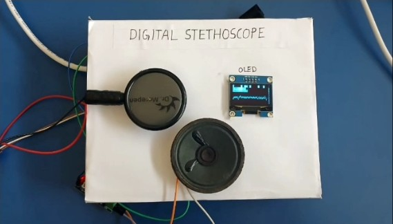

# Digital Stethoscope with Heartbeat Visualization using LPC2148

ARM7 | LPC2148 | Embedded Systems | Biomedical Instrumentation | Signal Processing | OLED Display

---

## Project Prototype

## Project Status

✅ Completed Academic Embedded Systems Project

---

## Project Overview

This project implements a **Digital Stethoscope** using the **LPC2148 ARM7 microcontroller** for capturing, amplifying, processing, and visualizing heartbeat signals in real time.

Unlike traditional stethoscopes that provide only acoustic output, this system converts heart sound vibrations into electrical signals, processes them digitally, calculates heart rate, and displays the heartbeat waveform on an OLED display.

The project demonstrates the application of **Embedded Systems and Biomedical Instrumentation** for low-cost healthcare monitoring solutions.

---

## Objectives

- Capture heartbeat sound using stethoscope chest piece and microphone  
- Amplify weak heartbeat signal using analog amplification circuit  
- Filter unwanted noise from input signal  
- Convert analog signal into digital data using LPC2148 ADC  
- Process heartbeat signal using Embedded C program  
- Calculate BPM (Beats Per Minute)  
- Display waveform and BPM on OLED display  
- Provide audio monitoring through speaker output  

---

## Hardware Components Used

- LPC2148 ARM7 Microcontroller  
- Electret Microphone / Sound Sensor  
- LM358 Operational Amplifier  
- Signal Filtering Circuit  
- SSD1306 OLED Display (I2C Interface)  
- Speaker  
- Resistors and Capacitors  
- Breadboard and Jumper Wires  
- 5V Power Supply  

---

## Software Tools Used

- Keil uVision IDE  
- Flash Magic  
- Embedded C Programming  
- LPC2148 ARM7 Development Environment  

---

## System Features

- Real-time heartbeat monitoring  
- BPM calculation  
- OLED waveform visualization  
- ADC based signal processing  
- Portable biomedical monitoring system  

---

## Experimental Results

The system successfully demonstrated:

- Heart sound acquisition  
- Analog signal amplification  
- ADC conversion using LPC2148  
- Real-time waveform display on OLED  
- BPM calculation and heartbeat monitoring  

---

## Future Scope

- Android App Integration  
- AI-based heartbeat abnormality detection  
- Cloud-based remote healthcare monitoring  
- Integration with ECG and SpO2 sensors  

---

## Author

**Poornima S**  
Electronics and Instrumentation Engineering  
Siddaganga Institute of Technology, Tumakuru
